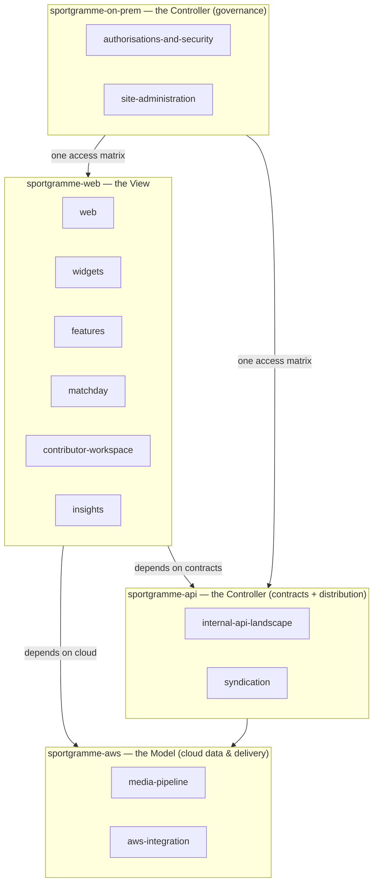

# Sportgramme — Architecture & Repository Map

This repository set is a **showcase of the platform**, not its build system. The
code lives elsewhere; here, each repository is a curated set of capability briefs
— *As a / I want / So that* plus conceptual diagrams — organised so a first-time
reader can see how much of a sports platform Sportgramme actually is.

## Why four repositories

The org used to hold ~14 repositories, most of them a single `README.md` plus one
`docs/CAPABILITY_BRIEFS.md`. That is a lot of cards on the org page and no shape.

They are now consolidated onto the axis that actually means something to a
visitor: **the surface a capability runs on** — the browser, the internal API,
the AWS cloud, or the restricted on-premise back office. Model / View /
Controller was considered and rejected as the top-level split: MVC is an
*in-application* pattern, not a boundary a reader can navigate. As a mental model
it still holds — the **AWS** landscape is broadly the Model (data, storage,
delivery), **Web** is the View, **On-Prem** + **API** are the Controller — but the
repositories are named for the surface, because that is what reads clearly.

## The four surfaces

This maps onto the existing
[Conceptual IT Landscape](Conceptual%20Views/IT%20and%20Integration%20Landscape.md):
**Web** ↔ Application; **API** ↔ Integration + Distribution; **AWS** ↔ Cloud;
**On-Prem** ↔ the Security / IAM spine (with the on-prem AI and data hubs as
capabilities in their own right).

## What went where

| New location | Former repository |
|---|---|
| `sportgramme-web/web/` | `sg-web` |
| `sportgramme-web/widgets/` | `sg-widgets` |
| `sportgramme-web/features/` | `sg-features` |
| `sportgramme-web/matchday/` | `sg-matchday` |
| `sportgramme-web/contributor-workspace/` | `sg-contributor-workspace` |
| `sportgramme-web/insights/` | `sg-insights` |
| `sportgramme-api/syndication/` | `sg-syndication` |
| `sportgramme-api/internal-api-landscape/` | *new* — was org project #3 |
| `sportgramme-aws/media-pipeline/` | `sg-media-pipeline` |
| `sportgramme-aws/aws-integration/` | `AWS-Integration` |
| `sportgramme-on-prem/site-administration/` | `sg-site-administration` |
| `sportgramme-on-prem/authorisations-and-security/` | `SG-AUTHORISATIONS-AND-SECURITY` |
| *(unchanged)* `.github` | platform vision, business, conceptual views, glossary |
| *(left standalone)* `sg_BO_Interop` | back-office interop — real code, not a showcase doc set |
| *(retired)* `sg_2025` | superseded showcase |

## Conventions

- Each capability folder holds a `README.md` in the house style — capability
  briefs, conceptual diagrams, **described not disclosed**: no endpoints, keys,
  feeds, hostnames or internal system names.
- Cross-surface dependencies are named, not wired: *"depends on the internal API"*
  resolves in [`sportgramme-api/internal-api-landscape/`](https://github.com/sportgramme/sportgramme-api/tree/main/internal-api-landscape),
  *"depends on the AWS landscape"* in [`sportgramme-aws/aws-integration/`](https://github.com/sportgramme/sportgramme-aws/tree/main/aws-integration).
- Shared vocabulary lives once, in [`Glossary/`](Glossary/).
