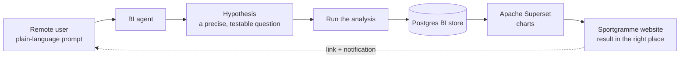
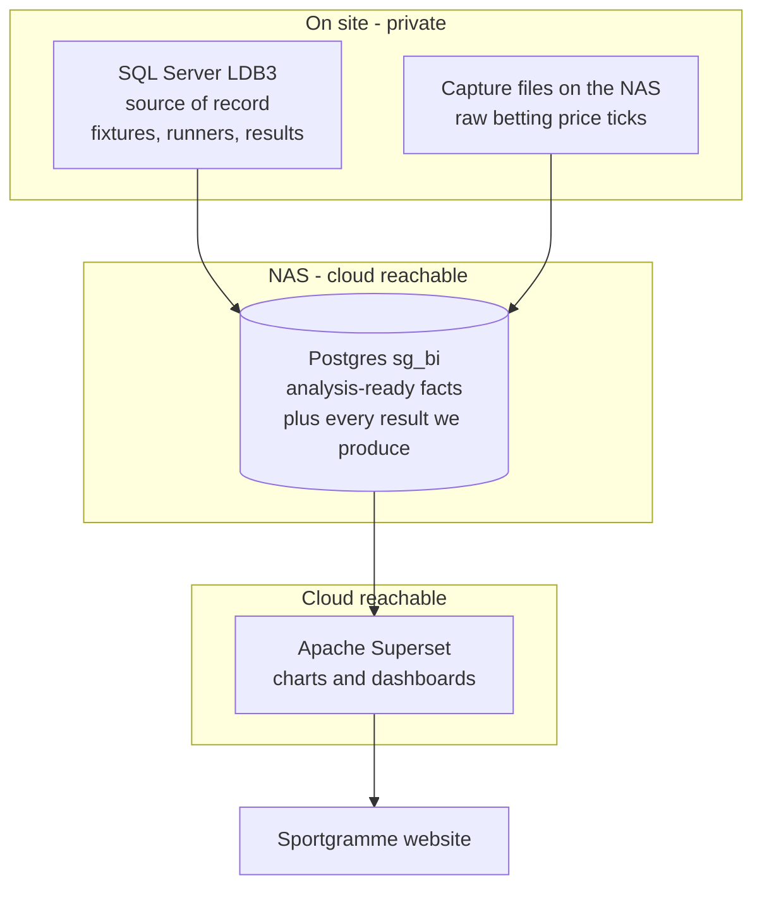
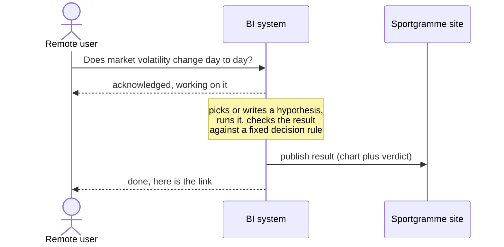
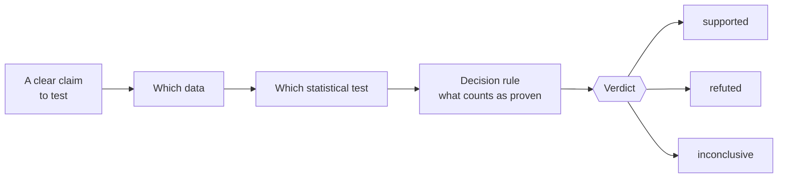
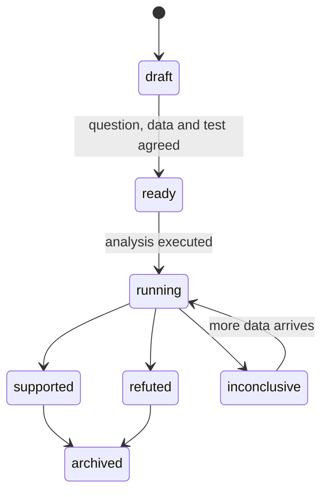

# Sportgramme Business Intelligence

**A hands-off analytics layer.** Ask a question in plain language, from anywhere.
The answer arrives on the Sportgramme website — no dashboards to build, no queries
to write, no software to open.

---

## The idea

You send a question. The system turns it into a repeatable analysis, runs it
against the betting-market data, stores the result, draws it, and drops it into
the right spot on the site. You get a link when it is ready.

---

## Why three data tiers

| Tier | Holds | Why it is separate |
|---|---|---|
| **SQL Server `LDB3`** | the operational truth — fixtures, runners, results | stays on-site and private; analysis never writes to it |
| **Postgres `sg_bi`** | analysis-ready data and every result we produce | reachable from the cloud, so tools and the website read results here — not from the private database |
| **Apache Superset** | the charts people actually look at | cloud-hosted; embeds straight into web pages |

---

## Asynchronous by design

Ask, walk away, get told when it lands.

---

## What a "hypothesis" is

A **precise, testable question**, written down once so the exact same analysis can
be re-run any time new data arrives.

The verdict is decided by a **fixed rule set in advance** — significance *and*
real-world size — never a judgement call after the fact. If there is not enough
data yet, the honest answer is *inconclusive*.

**Example — H001:** *"There is no day-to-day variation in market volatility —
every day's racing churns about the same amount."* The system measures how much
each race's prices swing back and forth, groups the races by day, and tests
whether the days genuinely differ.

---

## A hypothesis over its life

---

## Where answers appear

Every analysis is tied to a home on the website — a dashboard, a panel on a race
page, or a standing report. When a run finishes, that spot updates on its own and
you are sent the link.

---

## Glossary

Every term used across these docs is defined in the repo-wide
**[Glossary](../Glossary/)**, split alphabetically (A–C, D–F, …). Quick links:
[tick data](../Glossary/S-U.md#tick-data) ·
[hypothesis](../Glossary/G-I.md#hypothesis) ·
[verdict](../Glossary/V-Z.md#verdict) ·
[volatility](../Glossary/V-Z.md#volatility) ·
[sg_bi](../Glossary/S-U.md#sg_bi) ·
[LDB3](../Glossary/J-L.md#ldb3) ·
[Superset](../Glossary/S-U.md#superset)
