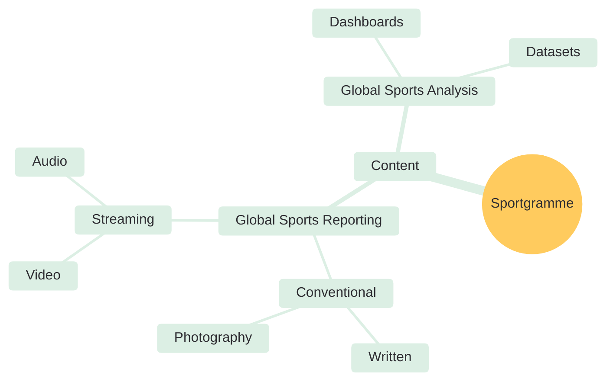

```mermaid

%%{init: {
  "theme": "base",
  "themeVariables": {
    "background": "#FFFFFF",

    "cScale0": "#2D2C31",
    "cScale0Text": "#FFFFFF",

    "cScale1": "#DCEFE4",
    "cScale1Text": "#2D2C31",

    "cScale2": "#C4E2D0",
    "cScale2Text": "#2D2C31",

    "cScale3": "#A6CFB6",
    "cScale3Text": "#2D2C31",

    "cScale4": "#EAF5EE",
    "cScale4Text": "#2D2C31",

    "lineColor": "#477A5C",
    "textColor": "#2D2C31",
    "primaryTextColor": "#2D2C31",
    "fontFamily": "Arial, Helvetica, sans-serif"
  }
}}%%

mindmap
  root((Sportgramme))

    Content

      Global Sports Reporting

        Conventional

          Written

          Photography

        Streaming

          Video

          Audio

      Global Sports Analysis

        Dashboards

        Datasets

```

International and national sports attract revenues from sportng attendance, attire affiliation, ticket sale and  broadcast rights. 
