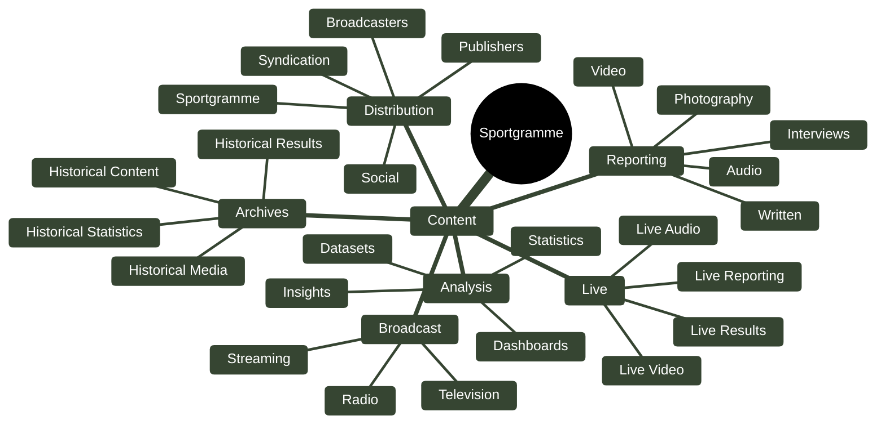

# Sportgramme — Content Ecosystem



## The Content Ecosystem

The model is essentially:

**Create → Enrich → Publish → Distribute → Consume → Archive**

Sportgramme's content isn't limited to a traditional article.

It encompasses:

| Content Area     | Formats                                                       |
| ---------------- | ------------------------------------------------------------- |
| **Reporting**    | Written, photography, video, audio, interviews                |
| **Analysis**     | Dashboards, datasets, statistics, insights                    |
| **Live**         | Live reporting, results, video, audio                         |
| **Archives**     | Historical content, results, statistics and media             |
| **Broadcast**    | Television, radio, streaming                                  |
| **Distribution** | Sportgramme, publishers, broadcasters, social and syndication |

### The important connection

Content should ultimately connect back into the Sportgramme sports model:

```text
                        SPORTGRAMME
                             │
                           CONTENT
                             │
       ┌─────────────┬───────┼────────┬─────────────┐
       │             │       │        │             │
   REPORTING      ANALYSIS   LIVE   BROADCAST     ARCHIVE
       │             │       │        │             │
       └─────────────┴───────┼────────┴─────────────┘
                             │
                         SPORTGRAMME
                          KNOWLEDGE
                             │
          ┌──────────────────┼──────────────────┐
          │                  │                  │
        SPORTS            ATHLETES          EVENTS
          │                  │                  │
          ├──────────────┬───┴───────┬──────────┤
          │              │           │          │
        TEAMS       COMPETITIONS   RESULTS   STATISTICS
          │              │           │          │
          └──────────────┴───────────┴──────────┘
                             │
                             ▼
                       DISTRIBUTION
                             │
             ┌───────────────┼───────────────┐
             ▼               ▼               ▼
           FANS          PUBLISHERS      BROADCASTERS
```

This is important because **Sportgramme content becomes much more valuable when it is connected to the underlying sports data**.

A photograph isn't just a photograph.

It can be connected to:

**Athlete → Event → Competition → Sport → Venue → Date → Result → Statistics → Story → History.**

Likewise, a video, article, interview or broadcast segment can become part of the same connected sporting record.

That is what differentiates the **Sportgramme Content Ecosystem** from a conventional media library.

