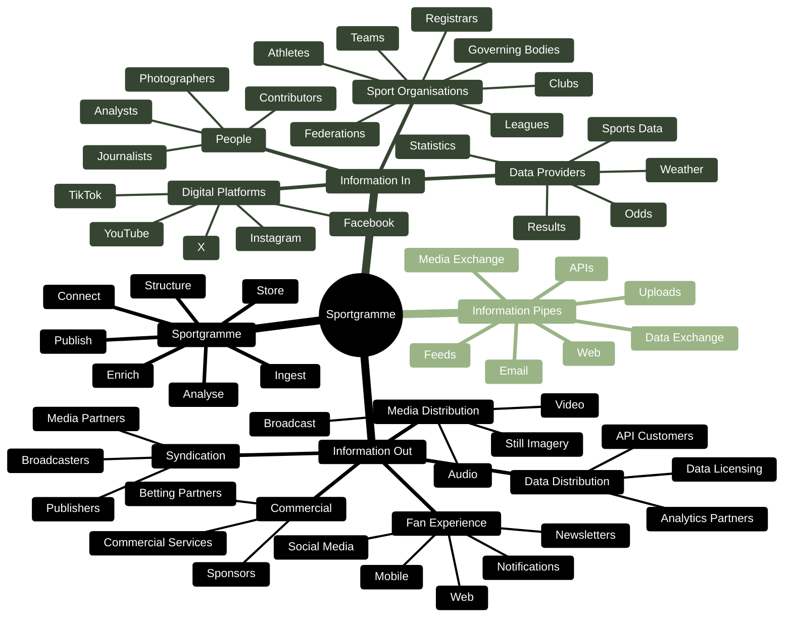

# Sportgramme — Information Flows & Pipes

Sportgramme sits at the centre of a global network of **information flows**.

Information enters through multiple pipes — from contributors, governing bodies, leagues, teams, athletes, data providers and digital platforms.

Sportgramme **ingests, connects, enriches, analyses and structures** that information before making it available through multiple outbound pipes to fans, media, publishers, broadcasters, syndication partners and data consumers.

The model is deliberately concerned with **what flows into and out of Sportgramme**, rather than the technology used to process it.

### The information-flow principle

The model can be reduced to:

> **Many sources → Sportgramme → Many destinations**

Sportgramme acts as the **central information connector**, bringing together fragmented sports information from across the ecosystem, enriching and connecting it, and then making it available through multiple distribution pipes.

The pipes themselves can vary according to the consumer:

**APIs · Feeds · Uploads · Data Exchange · Media Exchange · Web · Email**

This means the same underlying Sportgramme information can be delivered in different forms to different audiences.

### The strategic role of the pipes

The pipes are not simply technical interfaces.

They are the mechanisms through which Sportgramme creates its **network effect**:

**More sources → richer information → better Sportgramme → more valuable outputs → more consumers → more sources**

That creates a continuously expanding information ecosystem around Sportgramme.
