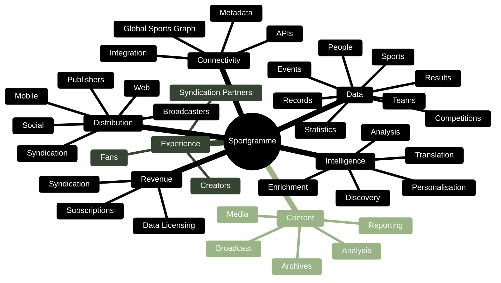
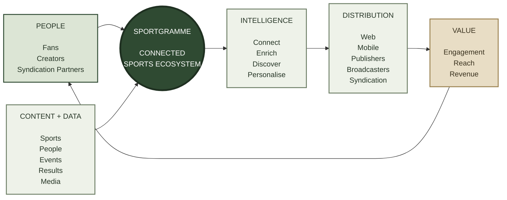

# Sportgramme — Conceptual View

At its simplest, Sportgramme is a **connected global sports ecosystem**.

It brings together people, content and data, applies intelligence to that information, connects it across the world of sport, and makes it available through multiple experiences and distribution channels.

The conceptual model deliberately separates **what Sportgramme is**, **what it does**, and **how it creates value**.

### The conceptual model

The simplest way to understand the platform is:

> **People create → Sportgramme connects and enriches → audiences consume → partners distribute → the ecosystem grows.**

### The strategic idea

Sportgramme is therefore **not simply a sports website, media company or data provider**.

It is the **connection layer** that brings together:

**The Fan + The Creator + The Syndication Partner**

around:

**Content + Data + Intelligence**

to create:

**Experience + Distribution + Value**

This is the conceptual foundation on which the more detailed **Fan, Creator, Content, Data, Technology and Revenue ecosystems** can then be built.
