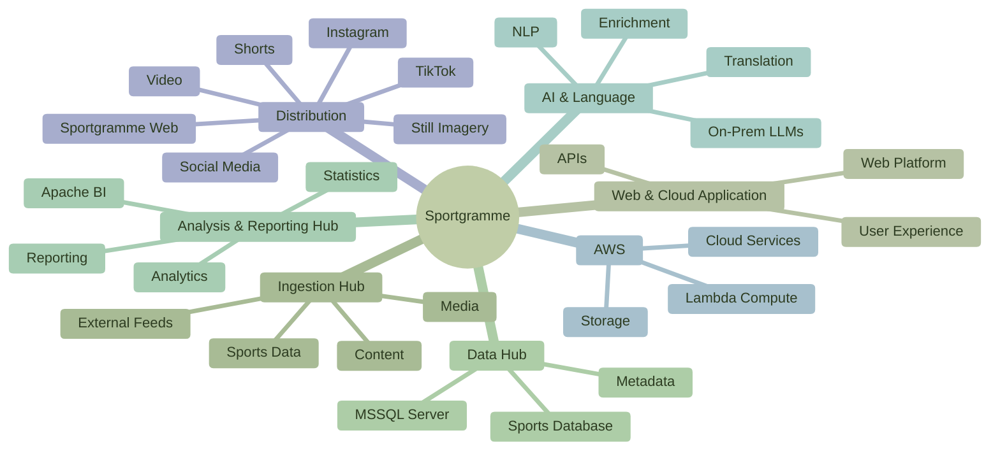

# Sportgramme — Conceptual IT Landscape

Sportgramme is a **cloud and web-based application** supported by a connected technology environment for ingesting, storing, processing, analysing and distributing sports information and media.

The conceptual IT landscape shows the principal technology hubs without moving into detailed technical architecture.

### The conceptual technology flow

**Ingest → Store → Analyse → Enrich → Publish → Distribute**

The major hubs are deliberately shown as **capabilities**, with the principal technologies identified beneath them.

The **Ingestion Hub** brings data, content, media and external feeds into Sportgramme.

The **Data Hub** provides the core structured sports information, supported by **MSSQL Server**.

The **Analysis & Reporting Hub** turns the accumulated data into statistics, analysis and reporting, supported by **Apache BI**.

The **AI & Language** capability uses on-premise **LLMs and NLP** to enrich, interpret and translate information.

**AWS** provides the cloud compute, storage and supporting environment, including **Lambda**.

Finally, Sportgramme distributes information and media through its own web platform and external channels including **video, still imagery, TikTok, Instagram and Shorts**.

> **A simple technology principle: Sportgramme ingests the world of sport, builds and enriches its data, applies intelligence, and distributes the resulting information and media wherever the audience is.**
