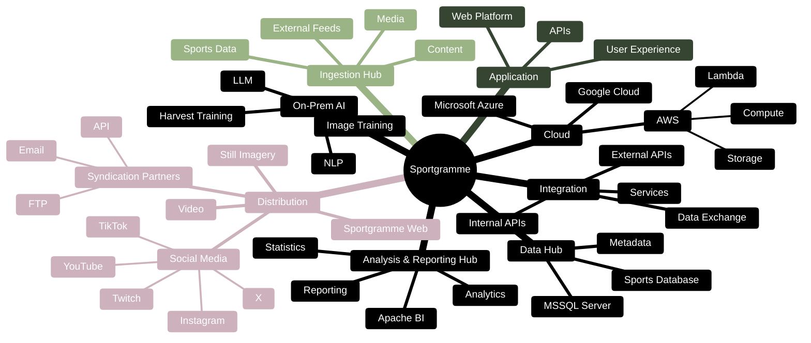

# Sportgramme — Conceptual IT Landscape

Sportgramme combines cloud-based infrastructure with **on-premise AI capabilities**, allowing the platform to use dedicated AI processing alongside its cloud application and data environment.

Moving on prem ensures 
- stability
- cost prudency
- security of proprietory  processes and  knowledge

### The AI model

The conceptual structure is now:

**On-Prem AI → LLM + NLP + Image Training + Harvest Training**

This makes **On-Prem AI** the capability, rather than treating an individual LLM as the entire AI environment.

It also provides a clean place for future AI capabilities to be added without changing the overall conceptual architecture.

The on-premise AI environment becomes a distinct capability within the Sportgramme technology landscape.

---

