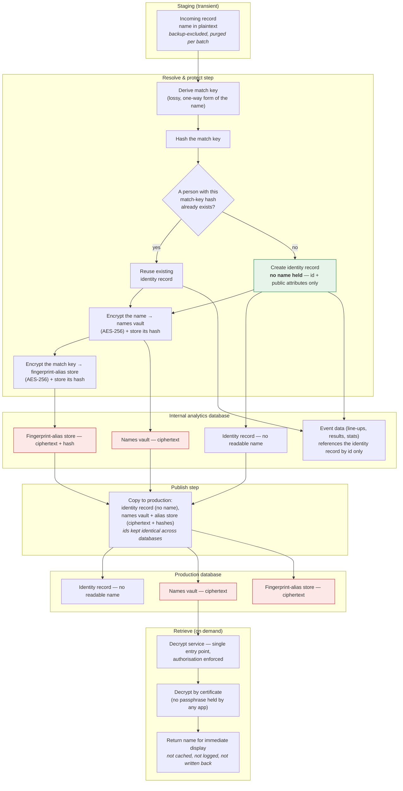

# GDPR — Name Protection Process

_Companion to `GDPR_Compliance.md` (read that first for the principles). This
document describes the **end-to-end process** by which a natural person's name is
kept out of plaintext at every stage of the data platform. It uses generic terms
and names no internal schema, procedure, host or service._

---

## 1. Purpose

Personal names enter the platform inside third-party sports data and news. This
process ensures that from the moment a name is resolved to a person, it exists
only as ciphertext — while the platform can still **deduplicate** people and
**retrieve** a name for display when authorised.

---

## 2. The process end to end

---

## 3. Why a fingerprint alias

Deduplication needs to recognise that two incoming records describe the same
person. It does this with a **match key** — a lossy, one-way reduction of the
name (it cannot be reversed to the name).

Rather than keep that match key as a readable value on the identity record, the
process **encrypts it** and stores it — with its hash — alongside the name in the
protected stores, tagged as a distinct kind of alias. Matching then runs against
the **hash**, so deduplication keeps working while no name-derived text sits on
the identity record itself.

The same store also holds other alias forms of a name (e.g. an initial-plus-
surname variant seen in one source), each encrypted and hash-indexed the same
way.

---

## 4. What never holds a readable name

- The identity record — in the internal database and in production.
- Event data (line-ups, results, statistics) — references people by id only.
- The production database, other than as ciphertext in the protected stores.
- Application configuration and source control — no decryption passphrase exists
  to hold; decryption is authorised through the database's own certificate chain.
- Logs — the decrypt service does not log the values it returns.

Non-personal entities (clubs, teams, racehorses, syndicates) are not personal
data and are stored normally.

---

_Last reviewed: 2026-08-30._
