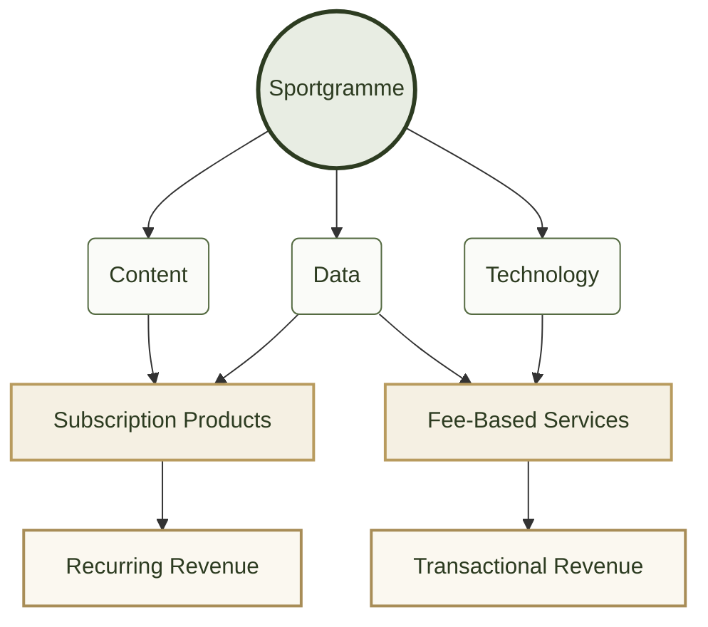
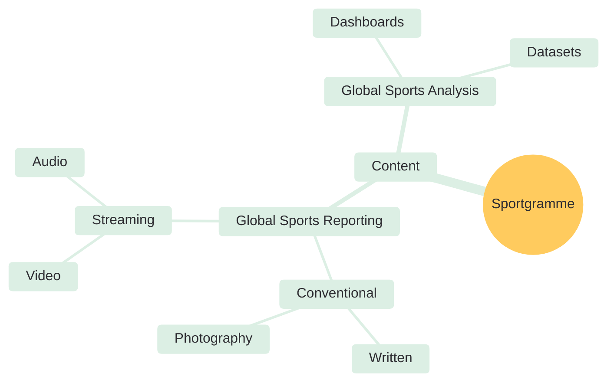
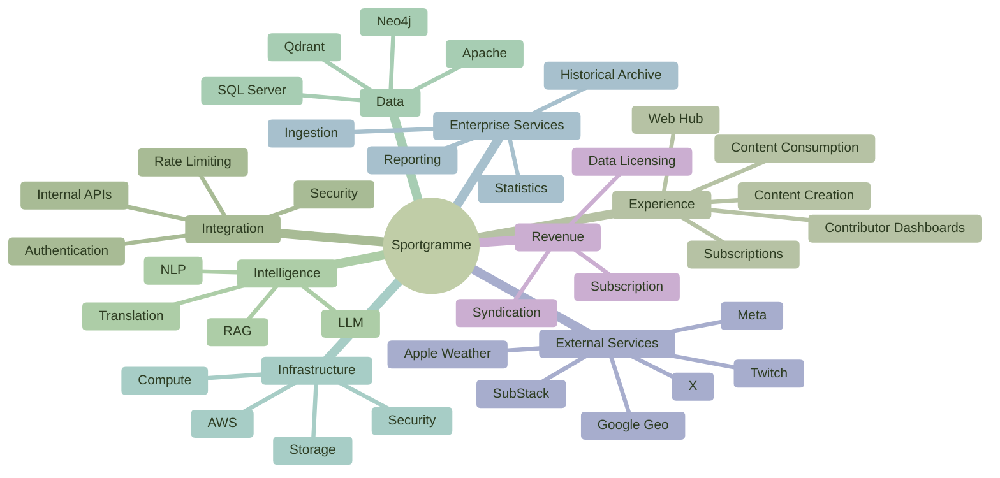
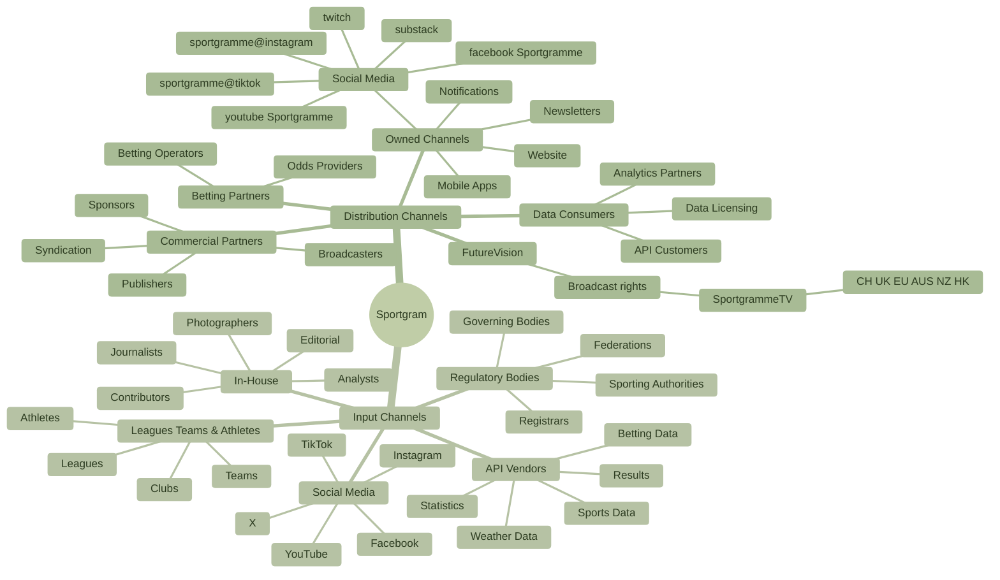

# sportgramme 
## The single source of truth for world sport data, media, market intelligence, unified and syndicated globally.
> More than **half** of the world's population engages with sports content. Premium sporting events remain among the largest media audiences ever recorded.
[Sports Viewership Statistics 2026 (Cometoplay)](https://blog.cometoplay.co.uk/sports-viewership-statistics/)

> "Global sports advertising market valued at $62.3 billion in 2025."
[Sports Advertising Market Research Report 2034 (DataIntelo)](https://dataintelo.com/report/sports-advertising-market).

> "The Global Sports Media Market reached USD 150 billion in 2025."
[Global Sports Media Market Size, Share & Forecast(Ken Research)](https://www.kenresearch.com/industry-reports/global-sports-media-market).

--- 
### The Status Quo

> "Sports Websites Tracked: 10,171 global tracked websites."
[OneLittleWeb Digital Market Intelligence (June 2026)](https://onelittleweb.com/digital-market-intelligence/popular-websites/sports/)).

The same source estimates that sports websites generated approximately:
>1.8 billion visits per month, representing about 0.6% of global web traffic.

### Largest Sports Sites
| Metric | Figure | Source |
|----------|----------:|----------|
| Global Sports Audience | 4.5 billion people consume sports content globally | [Sports Viewership Statistics 2026](https://blog.cometoplay.co.uk/sports-viewership-statistics/) |
| Global Sports Advertising Market (2025) | US$62.3 billion | [Sports Advertising Market Research Report 2034](https://dataintelo.com/report/sports-advertising-market) |
| Global Sports Media Market (2025) | US$150 billion | [Global Sports Media Market](https://www.kenresearch.com/industry-reports/global-sports-media-market) |
| Global Sports Media Rights (2025) | US$58 billion | [Global Sports Media Market](https://www.kenresearch.com/industry-reports/global-sports-media-market) |
| Sports Websites Tracked Globally | 10,171 websites | [Top Sports Websites by Traffic & Market Share](https://onelittleweb.com/digital-market-intelligence/popular-websites/sports/) |
| Sports Website Traffic | 1.8 billion visits per month | [Top Sports Websites by Traffic & Market Share](https://onelittleweb.com/digital-market-intelligence/popular-websites/sports/) |
| FIFA World Cup Audience (2022) | 5.4 billion viewers across the tournament | [Sports Viewership Statistics 2026](https://blog.cometoplay.co.uk/sports-viewership-statistics/) |
| FIFA World Cup Final Audience (2022) | 1.5 billion viewers | [Sports Viewership Statistics 2026](https://blog.cometoplay.co.uk/sports-viewership-statistics/) |
| UEFA Champions League Final Audience | 400–450 million viewers | [Sports Viewership Statistics 2026](https://blog.cometoplay.co.uk/sports-viewership-statistics/) |
| Olympic Games Audience (Tokyo 2020) | 3.6 billion viewers | [Global Sports Industry Statistics](https://worldmetrics.org/global-sports-industry-statistics/) |
| ESPN Monthly Visits | 529.6 million | [Most Popular Sports Websites in the World](https://analytics.explodingtopics.com/website/global/sports) |
| FIFA.com Monthly Visits | 374.2 million | [Most Popular Sports Websites in the World](https://analytics.explodingtopics.com/website/global/sports) |

## The Product

sportgramme is a global concern with the stated aim of holding sports data for all sports competed under  governance or a National governing body affilated with/to an internatonal governing body.

 ### The Content Model

 

International and national sports attract revenues from sportng attendance, attire affiliation, ticket sale and  broadcast rights. 

 ### The Landscape
 

## Inputs and outputs.

