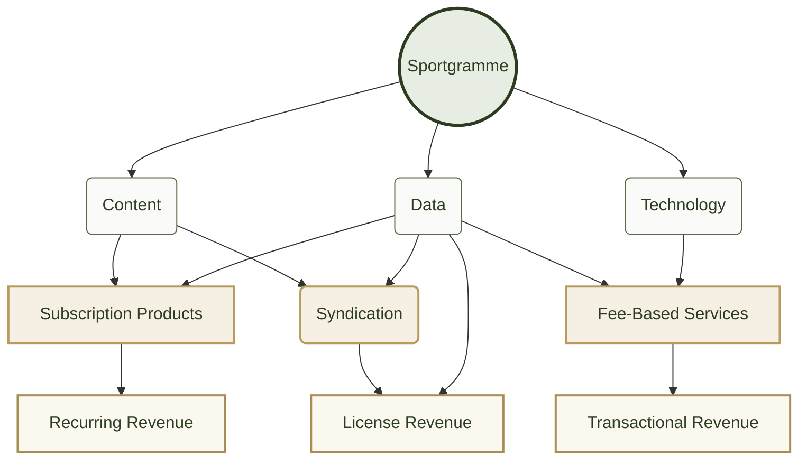

# sportgramme 

## 3 into 3 — the power of 3

“Sportgramme brings together three core capabilities: **content, data and technology**.

Those three capabilities unlock three distinct commercial models: **subscriptions, syndication and fee-based services**.

And those translate into three complementary revenue streams: **recurring, licensing and transactional revenue**.

The power of the model is that we’re not building three separate businesses. **We’re taking three underlying capabilities and creating three ways to monetise them — with each capability supporting multiple revenue opportunities.**”

## The fundamental proposition is:

> **Sportgramme enables creators to create,collaborate and enhance reputation as well as reaching far wider syndicate markets for their content.** 
  
> **Sportgramme gives fans a richer, better connected, single view of the sports and athletes they want to follow.**
  
> **Sportgramme delivers high quality sports content to syndication partners to distribute trusted, enriched content and data to wider audiences and markets.**

## The single source of truth for world sport data, media, market intelligence, unified and syndicated globally.
> More than **half** of the world's population engages with sports content. Premium sporting events remain among the largest media audiences ever recorded.
[Sports Viewership Statistics 2026 (Cometoplay)](https://blog.cometoplay.co.uk/sports-viewership-statistics/)

> "Global sports advertising market valued at $62.3 billion in 2025."
[Sports Advertising Market Research Report 2034 (DataIntelo)](https://dataintelo.com/report/sports-advertising-market).

> "The Global Sports Media Market reached USD 150 billion in 2025."
[Global Sports Media Market Size, Share & Forecast(Ken Research)](https://www.kenresearch.com/industry-reports/global-sports-media-market).

--- 

## The Product

sportgramme is a global concern with the stated aim of holding sports data for all sports competed under  governance or a National governing body affilated with/to an internatonal governing body.

 

