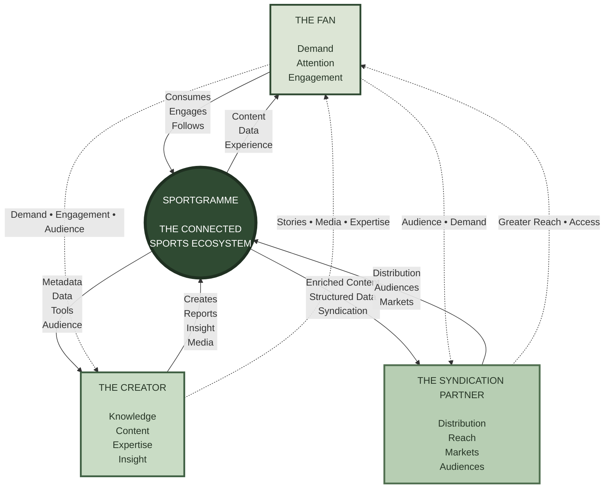
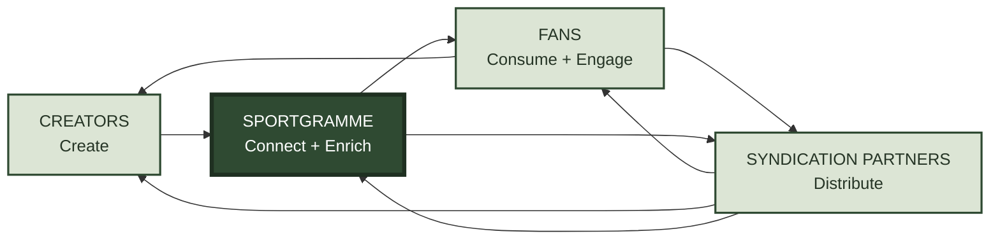

# Sportgramme — The Three Pillars

Sportgramme is built around **three essential pillars: The Fan, The Creator and The Syndication Partner**.

Each is essential to the success of the ecosystem.

**The Fan creates demand and engagement.**
**The Creator creates knowledge, content and insight.**
**The Syndication Partner creates reach and distribution.**

Sportgramme connects them, adding the data, metadata, technology and infrastructure that allows each pillar to create greater value for the others.

> **Creators create. Fans engage. Syndication Partners extend the reach. Sportgramme connects them.**

### The ecosystem flywheel

The relationship creates a continuous cycle of value:

The fundamental proposition is:

> **Sportgramme enables creators to create and collaborate, gives fans a richer and more connected sports experience, and enables syndication partners to distribute trusted, enriched content and data to wider audiences and markets.**

**Each pillar strengthens the others.**

That interconnectedness is the foundation of the Sportgramme business model.
