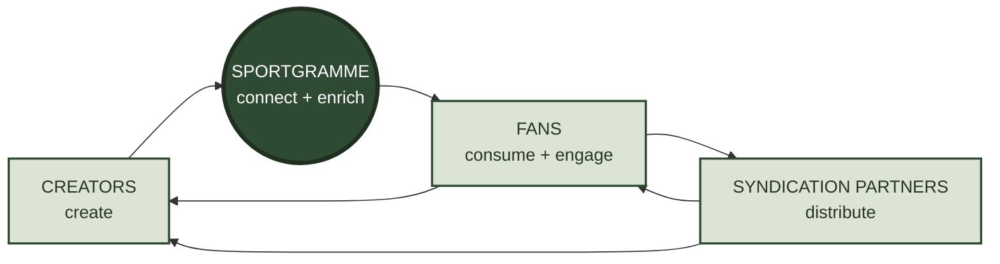

# Sportgramme

**The single source of truth for world sport — data, media and market
intelligence — unified and syndicated globally.**

Sportgramme brings together three capabilities — **content, data and technology** —
and turns them into three ways to monetise: **subscriptions, syndication and
fee-based services**. One platform, three revenue streams, each capability feeding
more than one.

## The platform, by surface

| Surface | What it is |
|---|---|
| [**sportgramme-web**](https://github.com/sportgramme/sportgramme-web) | The browser surface — public site, embeddable widgets, and the contributor tools for authoring, match-day and media |
| [**sportgramme-api**](https://github.com/sportgramme/sportgramme-api) | The internal API landscape every surface consumes, and the syndication channels that distribute content to partners |
| [**sportgramme-aws**](https://github.com/sportgramme/sportgramme-aws) | The cloud landscape — media pipeline, storage, CDN, and the delivery / moderation / brokering functions |
| [**sportgramme-on-prem**](https://github.com/sportgramme/sportgramme-on-prem) | The restricted back office — the platform-wide access-control model and its operator console |

## Dig deeper

- [**ARCHITECTURE.md**](ARCHITECTURE.md) — how the four surfaces fit together, and why the repositories were consolidated
- [**Value Proposition**](Value%20Proposition.md) · [**Business Models**](Business%20Models/) · [**Business Case**](Business%20Case/)
- [**Conceptual Views**](Conceptual%20Views/) — information flows, content landscape, IT & integration landscape
- [**Business Intelligence**](Business%20Intelligence/) — the analytics framework and statistics catalogue
- [**Glossary**](Glossary/) — shared platform, distribution and analytics terms

> Every capability is documented as *As a / I want / So that* briefs with
> conceptual diagrams — what it does and the value it delivers, not its internals.
